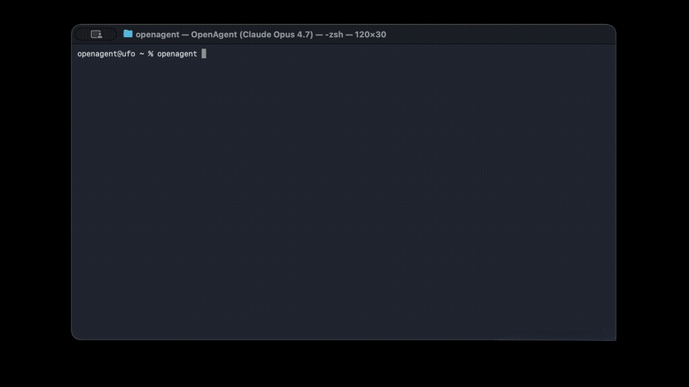

<p align="center">
  
</p>

<p align="center">
  <strong>Open-source agentic coding CLI for your terminal.</strong><br>
  Multi-provider. Token-efficient. Extensible.
</p>

<p align="center">
  <a href="https://github.com/ask-sol/openagent/blob/main/LICENSE"></a>
  <a href="https://github.com/ask-sol/openagent/releases"></a>
  <a href="https://github.com/ask-sol/openagent/stargazers"></a>
  <a href="https://github.com/ask-sol/openagent/issues"></a>
  
  
  
  
</p>

<br>

<p align="center">
  
</p>

---

## What is OpenAgent?

OpenAgent is a terminal-based AI coding assistant — like Claude Code, but provider-agnostic. Bring your own API key from any major provider (or use OpenRouter for all of them with one key) and get agentic coding, web search, social media posting, and 50+ commands in a clean terminal UI.

```
   ____                   ___                    __
  / __ \____  ___  ____  /   | ____ ____  ____  / /_
 / / / / __ \/ _ \/ __ \/  /| |/ __ `/ _ \/ __ \/ __/
/ /_/ / /_/ /  __/ / / / ___ / /_/ /  __/ / / / /_
\____/ .___/\___/_/ /_/_/  |_\__, /\___/_/ /_/\__/
    /_/                     /____/
```

---

## Install

### Homebrew (macOS)

```bash
brew install ask-sol/openagent/openagent
```

### Manual

```bash
git clone https://github.com/ask-sol/openagent.git
cd openagent
bash scripts/install-user.sh
```

Then run `openagent` from any directory.

---

## Quick Start

```bash
# First run — interactive setup wizard
openagent

# Unrestricted mode (no permission prompts)
openagent -u

# Cautious mode (asks before every action)
openagent -c

# Enable thinking mode
openagent -t
```

On first launch, OpenAgent walks you through picking a provider, entering your API key, choosing a model, and selecting a response style.

---

## Providers

One API key is all you need. OpenRouter gives access to every major model with a single key.

| Provider | Models | Key |
|:---|:---|:---|
| **OpenRouter** | GPT-4.1, Claude Opus 4, Gemini 2.5 Pro, Llama, Mistral, DeepSeek, Grok + 100 more | [openrouter.ai/keys](https://openrouter.ai/keys) |
| **OpenAI** | GPT-4.1, GPT-4o, o3, o4-mini | [platform.openai.com](https://platform.openai.com/api-keys) |
| **Anthropic** | Claude Opus 4, Sonnet 4, Haiku 3.5 | [console.anthropic.com](https://console.anthropic.com/settings/keys) |
| **Google Gemini** | Gemini 2.5 Pro, 2.5 Flash, 2.0 Flash | [aistudio.google.com](https://aistudio.google.com/apikey) |
| **Mistral** | Mistral Large, Codestral, Small | [console.mistral.ai](https://console.mistral.ai/api-keys) |
| **Groq** | Llama 3.3 70B, DeepSeek R1, Mixtral | [console.groq.com](https://console.groq.com/keys) |
| **DeepSeek** | DeepSeek V3, R1 | [platform.deepseek.com](https://platform.deepseek.com/api_keys) |
| **xAI** | Grok 3, Grok 3 Mini, Grok 2 | [console.x.ai](https://console.x.ai) |
| **Ollama** | Any local model | [ollama.com](https://ollama.com/download) |

Switch providers on the fly with `/provider` or `/model` — interactive selectors, no config files to edit.

---

## Features

### Agentic Coding
Read, write, and edit files. Run shell commands. Search codebases by filename or content. OpenAgent handles multi-step tasks autonomously — creating files, running tests, fixing errors in a loop.

### Permission Modes

| Mode | Flag | Behavior |
|:---|:---|:---|
| **Standard** | (default) | Asks before file writes, commands, and network requests |
| **Cautious** | `-c` | Asks before every single tool call |
| **Unrestricted** | `-u` | No prompts — full auto. First-time per directory confirmation required |

```
┌─────────────────────────────────────────────────────┐
│ ? Bash — Run command: npm install express           │
│   Allow?  y es  n o  a lways                        │
└─────────────────────────────────────────────────────┘
```

### Token Efficient
**Concise mode** strips filler from AI responses. No "Great question!", no "Sure, I'd be happy to help!", no paragraphs explaining what it's about to do. Code quality is never compromised — only conversation gets shorter.

### Web Search
Built-in DuckDuckGo search. Ask the AI to look something up and it fetches results, reads pages, and synthesizes answers.

### Social Media
Post to Reddit and X directly from your terminal.

```bash
/setup-reddit    # One-time OAuth flow
/setup-x         # One-time OAuth flow
```

Then just ask: *"Post to r/programming about OpenAgent"*

### Local Session Resume
All sessions are stored locally at `~/.openagent/sessions/`. Resume any previous conversation with `/resume`. No cloud, no accounts, no sync — your data stays on your machine.

### CONTEXT.session
A persistent file per project that accumulates context across sessions. When the model runs out of context window, it reads this file to recall what it knows. Builds up automatically.

### MCP Servers
Connect to any MCP-compatible tool server. Configure in `~/.openagent/mcp_servers.json`.

### Terminal Responsive
Adapts to terminal resize instantly. Full ASCII banner on wide terminals, compact on narrow ones.

---

## Commands

<details>
<summary><strong>50+ built-in commands</strong> (click to expand)</summary>

| Category | Commands |
|:---|:---|
| **General** | `/help` `/exit` `/version` `/doctor` `/changelog` `/feedback` |
| **Conversation** | `/clear` `/compact` `/copy` |
| **Session** | `/resume` `/context` `/tokens` `/export` `/rename` `/tag` `/memory` `/stats` |
| **Git** | `/diff` `/status` `/branch` `/log` `/stash` `/commit` `/push` `/pull` `/pr` |
| **Permissions** | `/permissions` `/mode` |
| **Config** | `/provider` `/model` `/config` `/response-mode` `/setup` `/env` `/alias` |
| **Tools** | `/tools` `/mcp` |
| **Files** | `/files` `/pwd` `/find` `/grep` `/cat` `/size` |
| **Shell** | `/run` `/npm` |
| **Dev** | `/test` `/lint` `/build` `/dev` `/snippet` `/benchmark` `/deps` `/debug` |
| **Workflow** | `/plan` `/undo` `/rewind` `/todo` |
| **UI** | `/theme` `/vim` `/brief` `/keybindings` |
| **Utility** | `/time` `/calc` `/json` `/encode` `/decode` `/uuid` `/hash` `/ip` `/port` `/processes` `/disk` `/open` |
| **Social** | `/setup-reddit` `/setup-x` `/reddit` `/tweet` |
| **Fun** | `/weather` |

</details>

---

## Architecture

```
openagent/
├── bin/openagent              # Entry script
├── src/
│   ├── entrypoints/cli.tsx    # CLI bootstrap (Commander)
│   ├── components/            # Ink/React terminal UI
│   │   ├── REPL.tsx           # Main interactive loop
│   │   ├── Setup.tsx          # First-run wizard
│   │   ├── ProviderPicker.tsx # Interactive provider selector
│   │   └── ModelPicker.tsx    # Interactive model selector
│   ├── providers/             # 9 provider implementations
│   ├── tools/                 # Bash, FileRead, FileEdit, Glob, Grep, WebSearch, Reddit, X
│   ├── commands/              # 50+ slash commands
│   ├── query.ts               # Core agent loop (stream → tools → loop)
│   ├── session/               # Local session storage & resume
│   ├── config/                # Settings & permissions
│   ├── mcp/                   # MCP server client
│   └── utils/                 # System prompt, terminal helpers
├── scripts/                   # Build & install scripts
└── Formula/                   # Homebrew formula
```

---

## Contributing

Contributions welcome. Open an issue or PR.

## License

MIT
